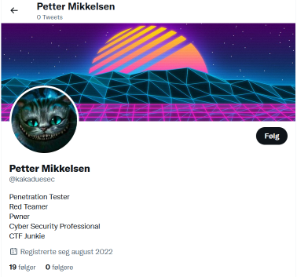
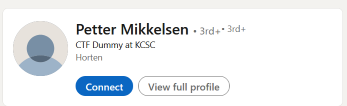
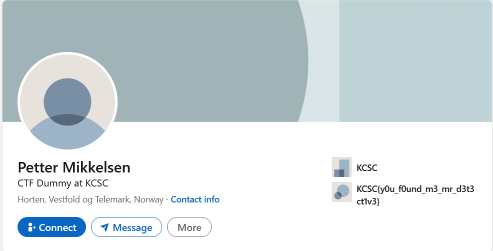

# CTF Write-Up - Anonymous Hacker

## Description

The challenge is to find the flag that is hidden on the social media platforms of a person who claims to have extreme hacking skills and could be a potential new employee for KCSC. The only information provided is their GitHub account: https://github.com/pimsecurity.

## Techniques Used

- Social media profiling
- Search engine queries
- Linkedin searching

## Solution

To solve this challenge, I first visited the provided GitHub account, which linked to a Twitter account with the handle "kakaduesec" the name on the twitter profile was Petter Mikkelsen.

From the hint that the person "liked to talk a lot about work", I suspected that they might have a LinkedIn account.

I searched for the person on LinkedIn using the name found on Twitter, but found over 190 results. To narrow down the search, I added "KCSC" to the search query, which led me to a LinkedIn profile of a person who works as "CTF Dummy at KCSC".

By going into this profile, I was able to see that his education was the flag: **`KCSC{y0u_f0und_m3_mr_d3t3ct1v3}`** 

## Conclusion

This challenge required an understanding of social media profiling and the ability to effectively use search engine queries and LinkedIn searching. By following the provided clues and using the correct search queries, I was able to find the flag on the person's LinkedIn profile.
