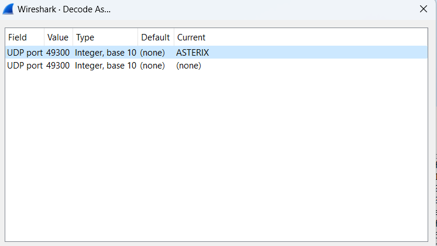
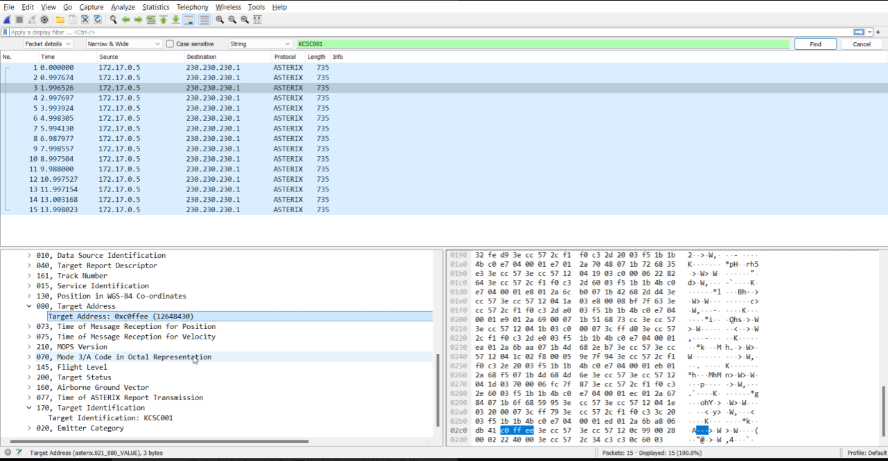

# CTF Write-Up - Radar Log 1

## Description

The challenge is to analyze radar data from an aircraft with the callsign KCSC001 that was discovered at low altitude passing over an interesting area in Norway. The goal is to find the aircraft's hexadecimal address ("Aircraft Address") and wrap it in the KCSC{}-tag.

## Techniques Used

- Wireshark
- Network protocol analysis
- Filtering by Asterix 

## Solution

To solve this challenge, I used Wireshark to analyze the radar data. One of the Hints given is a picture of Asterix from Asterix & Obelix. By googling around I stumbeled onto the following wikipedia page: https://en.wikipedia.org/wiki/ASTERIX_(ATC_standard)

Knowing this the first step was to filter the data by the protocol Asterix, as this protocol is commonly used in radar data.

Once the data was filtered, I looked for the aircraft's callsign (KCSC001) in the packet details. I found that the hexadecimal address of the aircraft was included in the packet data. 

By following these steps, I was able to successfully find the aircraft's hexadecimal address and complete the challenge.  KCSC{0xc0ffee}

## Conclusion

This challenge required an understanding of network protocols, specifically Asterix, as well as the ability to use Wireshark to filter and analyze packet data.
